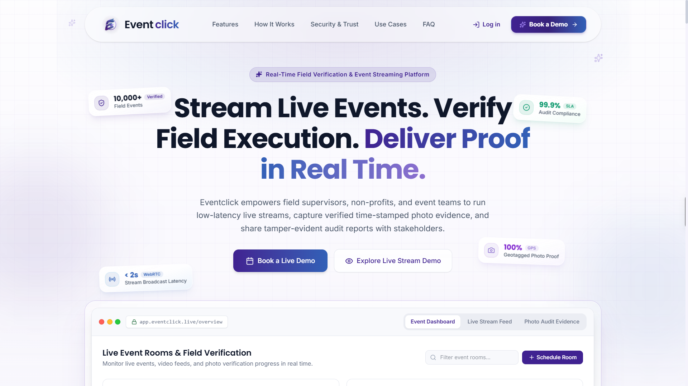

# Eventclick - Verified Field Event Execution SaaS



Eventclick is a powerful platform designed to empower NGOs, corporate CSR foundations, and government projects with real-time video streaming, tamper-evident geotagged photo proof, and automated audit reporting.

This repository contains the **Landing Page and Marketing Site** for Eventclick (`eventclick.live`). It is a highly optimized, static, Next.js application designed for maximum performance, SEO, and visual fidelity using an Apple-inspired minimalist design system (frosted glass, spring physics, deep gradients).

## 🚀 Core Capabilities Highlighted

- **Ultra-Low Latency Streaming:** Interactive walkthroughs and platform demonstrations.
- **Geotagged Camera Photos:** Features detailing our tamper-proof field verification system.
- **Smart Completion Gates:** Explanations of automated, rigorous event check-ins.
- **Governance & RBAC:** Documentation of our Role-Based Access Control and permission matrix.
- **Zero-Trust Security:** Showcase of our SOC2/GDPR compliance and encryption standards.

## 🛠 Tech Stack

- **Framework:** Next.js 16 (App Router)
- **Language:** TypeScript
- **Styling:** Tailwind CSS (v4) with custom Brand Palette (`#402291` to `#3160B7`)
- **Animations:** Framer Motion
- **Icons:** Lucide React
- **Tooling:** Turbopack

## 📁 Project Structure

- `/app` - Next.js App Router endpoints (`/`, `/contact`, `/privacy`, `/terms`)
- `/components` - Reusable UI elements (`HeroSection`, `FeatureBento`, `TargetUsers`, etc.)
- `/assets` - Static images, logos, and media.
- `sitemap.ts` & `robots.ts` - Dynamic SEO configuration.

## 💻 Local Development Setup

**Prerequisites:** Node.js (v18+)

1. **Install dependencies:**
   ```bash
   bun install
   ```
2. **Run the development server (with Turbopack for faster HMR):**
   ```bash
   bun run dev
   ```
3. **Open the application:**
   Navigate to [http://localhost:3000](http://localhost:3000) in your browser.

## 🚢 Deployment Architecture

This application is fully decoupled from the core SaaS application to ensure maximum uptime, speed, and safety for marketing traffic.

- **Hosting Platform:** Cloudflare Pages
- **Build Command:** `npm run build`
- **Output Directory:** `.vercel/output/static` (Cloudflare automatically adapts to Next.js)
- **Domain:** `eventclick.live` (managed via Cloudflare DNS)
- **Associated SaaS Backend:** `app.eventclick.live` (Hosted on AWS EC2)

## 🔒 Production Readiness

This project has passed comprehensive SEO, performance, and type-safety audits.

- Full OpenGraph and Twitter Card metadata implemented.
- Semantic HTML landmarks mapped.
- Zero TypeScript/Build errors.

---

\*Engineered by **NextVentures\***
